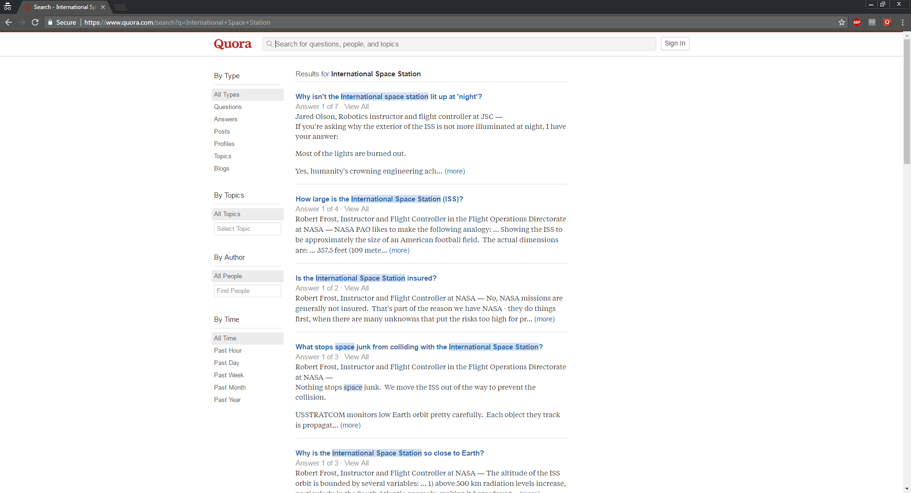
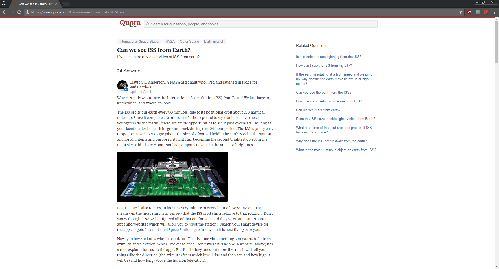

# Quora NoLogin Chrome Extension `1.0`  
 
### Features:
- Adds `?share=1` at the end of the Quora's Question URL.
- Removes Ads.
- Disables Login Button.
- Adds a special new Quora icon when viewing an answer.

## Search Query

## Question

## Installation

1. **[Click here to download](https://github.com/aldiduzha/quora-nologin-chrome-extension/archive/master.zip)**, unzip the file and save the folder on your computer.
2. Drag and drop it in Chrome’s `Settings > Extensions`.
3. Done!

__Note:__ If you delete the folder with the extension on your computer it will also be removed from Chrome too.

## License

Licensed under [MIT](LICENSE) by [aldiduzha](http://aldiduzha.com).
